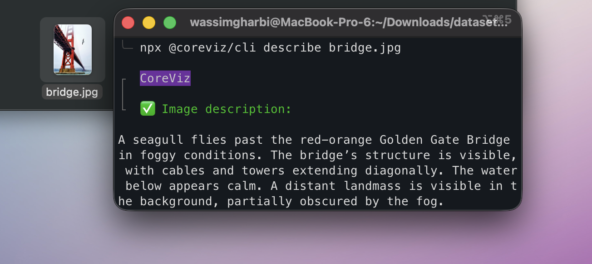
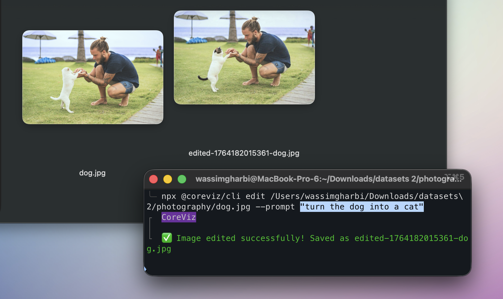

# @coreviz/cli

An AI-powered CLI for working with photos. Semantically search, edit, tag and generate metadata for thousands of photos right from the command line. 

## Installation

```bash
npm install -g @coreviz/cli
```

## Usage

```bash
# Run directly with npx
npx @coreviz/cli [command]

# Or if installed globally
coreviz [command]
```

## Commands

### Authentication

Login to CoreViz using device authorization:

```bash
npx @coreviz/cli login
```

Logout:

```bash
npx @coreviz/cli logout
```

Check login status:

```bash
npx @coreviz/cli whoami
```

### AI Features

Describe an image:

```bash
npx @coreviz/cli describe path/to/image.jpg
```




Edit an image with a text prompt (🍌 Nano Banan + Flux Kontext in the CLI!):

```bash
npx @coreviz/cli edit path/to/image.jpg --prompt "make it cyberpunk style"
```



Search local images using natural language:

```bash
npx @coreviz/cli search "a person wearing a red t-shirt"
```


This will index the images in your current directory (creating a `.index.db` file) and return the top matches for your query.

## Development

1. Install dependencies:
   ```bash
   cd cli
   npm install
   ```

2. Run local CLI:
   ```bash
   node bin/cli.js --help
   ```