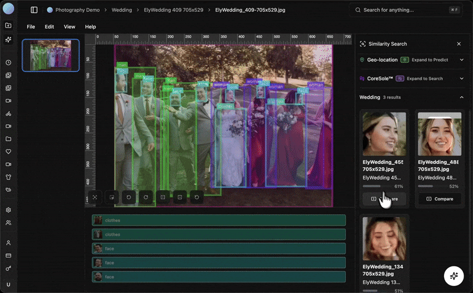
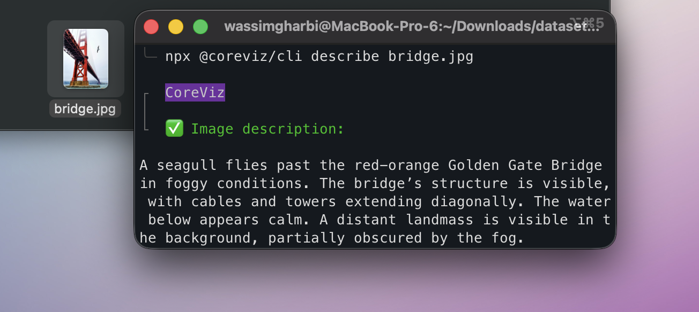
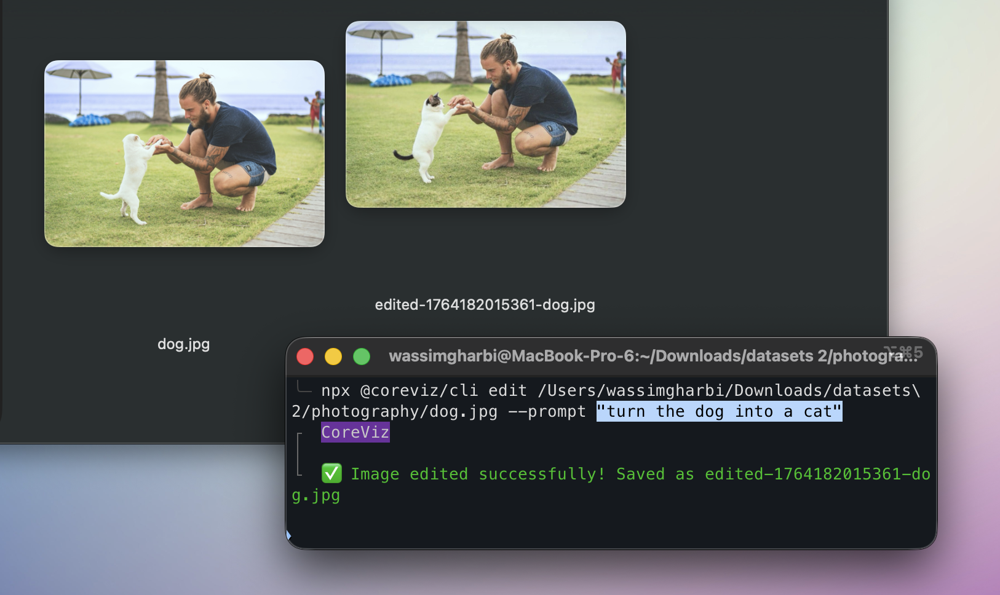

[](https://coreviz.io)

<div align="center">
    <h1>CoreViz</h1>
    <a href="https://coreviz.io/">Home</a>
    <span>&nbsp;&nbsp;•&nbsp;&nbsp;</span>
    <a href="https://lab.coreviz.io/">Studio</a>
    <span>&nbsp;&nbsp;•&nbsp;&nbsp;</span>
    <a href="https://github.com/coreviz/cli">CLI</a>
    <span>&nbsp;&nbsp;•&nbsp;&nbsp;</span>
    <a href="https://github.com/coreviz/sdk">SDK</a>
    <span>&nbsp;&nbsp;•&nbsp;&nbsp;</span>
    <a href="https://docs.coreviz.io/">Docs</a>
    <span>&nbsp;&nbsp;•&nbsp;&nbsp;</span>
    <a href="https://x.com/withcoreviz">X</a>
    <span>&nbsp;&nbsp;•&nbsp;&nbsp;</span>
    <a href="https://www.linkedin.com/company/coreviz/">LinkedIn</a>
    <span>&nbsp;&nbsp;•&nbsp;&nbsp;</span>
    <a href="mailto:team@coreviz.io">Contact</a>
  <br />
  <br />

CoreViz is a Vision AI platform for teams and individuals working with thousands of visual assets.

  <p align="center">
    <a href="https://coreviz.io"></a>
  </p>
</div>


# @coreviz/cli

<p align="center">
   <a href="https://coreviz.io"></a>
</p>

An AI-powered CLI for working with photos. Semantically search, edit, tag and generate metadata for thousands of photos right from the command line. 

## Installation

```bash
npm install -g @coreviz/cli
```

## Usage

```bash
# Run directly with npx
npx @coreviz/cli [command]

# Or if installed globally
coreviz [command]
```

## Commands
### AI Features

Describe an image:

```bash
npx @coreviz/cli describe path/to/image.jpg
```




Edit an image with a text prompt (🍌 Nano Banan + Flux Kontext in the CLI!):

```bash
npx @coreviz/cli edit path/to/image.jpg --prompt "make it cyberpunk style"
```



Generate tags or classify an image:

```bash
npx @coreviz/cli tag path/to/image.jpg "objects in the image"
```

Classify an image using specific choices:

```bash
npx @coreviz/cli tag path/to/image.jpg --choices "receipt,invoice,document" --single
```

Run tagging locally (offline capable):

```bash
npx @coreviz/cli tag path/to/image.jpg "prompt" --mode local
```

Search local images using natural language:

```bash
npx @coreviz/cli search "a person wearing a red t-shirt"
```


This will index the images in your current directory (creating a `.index.db` file) and return the top matches for your query.

You can also use the cloud API for embeddings:

```bash
npx @coreviz/cli search "query" --mode api
```


### Scripting

All commands support a `--quiet` flag to suppress UI output and return only raw results.

```bash
# Returns only the file path of the edited image
npx @coreviz/cli edit image.jpg "prompt" --quiet
```

### Authentication

Login to CoreViz using device authorization:

```bash
npx @coreviz/cli login
```

Logout:

```bash
npx @coreviz/cli logout
```

Check login status:

```bash
npx @coreviz/cli whoami
```

## MCP Server (Claude Code Integration)

`@coreviz/cli` includes a built-in MCP server that exposes your CoreViz visual library as tools for Claude Code and other MCP-compatible AI agents — turning CoreViz into a **visual memory** for your AI workflows.

### Setup

1. Login (if you haven't already):
   ```bash
   npx @coreviz/cli login
   ```

2. Connect to your MCP client:

**Claude Code** — Install the plugin (recommended):

```bash
claude plugin marketplace add coreviz/cli
claude plugin install coreviz@coreviz
```

Or configure MCP manually in `~/.claude/settings.json`:

```json
{
  "mcpServers": {
    "coreviz": {
      "command": "npx",
      "args": ["coreviz-mcp"]
    }
  }
}
```

**Claude Desktop** — Add to `~/Library/Application Support/Claude/claude_desktop_config.json`:

```json
{
  "mcpServers": {
    "coreviz": {
      "command": "npx",
      "args": ["coreviz-mcp"]
    }
  }
}
```

3. In Claude Code, run `/mcp` to confirm the server is connected.

### Available MCP Tools

| Tool | Description |
|------|-------------|
| `list_collections` | List all collections in your workspace |
| `create_collection` | Create a new collection |
| `browse_media` | Navigate folders and list media items |
| `search_media` | Semantic search across all your media |
| `get_media` | Get full details, tags, and detected objects for an item |
| `get_tags` | Aggregate all tags across a collection |
| `find_similar` | Find visually similar images by object ID |
| `analyze_image` | Run AI vision analysis on an image URL |
| `create_folder` | Create a new folder |
| `move_item` | Move a file or folder |
| `rename_item` | Rename a file or folder |
| `add_tag` | Add a tag to a media item |
| `remove_tag` | Remove a tag from a media item |
| `upload_media` | Upload a local photo or video file to a collection |

### Local development override

```json
{
  "mcpServers": {
    "coreviz": {
      "command": "node",
      "args": ["/path/to/@coreviz/cli/bin/mcp.js"],
      "env": {
        "COREVIZ_API_URL": "http://localhost:3000"
      }
    }
  }
}
```

You can also authenticate via environment variable instead of `coreviz login`:
```bash
COREVIZ_API_KEY=your_key npx coreviz-mcp
```

---

## Development

1. Install dependencies:
   ```bash
   cd cli
   npm install
   ```

2. Run local CLI:
   ```bash
   node bin/cli.js --help
   ```

3. Run local MCP server:
   ```bash
   node bin/mcp.js
   ```